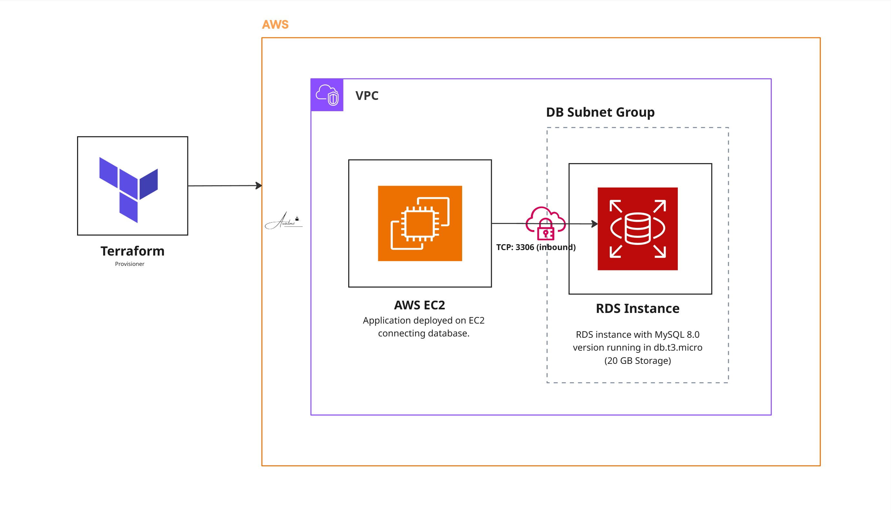

# Project 17: Secure RDS MySQL Deployment with Terraform

This Terraform setup deploys a private MySQL 8.0 RDS instance right inside our VPC. It’s basically a dev or staging template out of the box. The database resides in a dedicated DB subnet group for high availability, and its attached to a custom parameter group for better performance. For security, we're keeping it strictly internal. The security group drops everything except traffic hitting port 3306 from inside the VPC itself. Zero public exposure. 

## Architecture



## What It Provisions

- **Security Group:** Hardens the perimeter. Allows inbound MySQL connections (port 3306) strictly from your VPC CIDR block. 
- **DB Subnet Group:** Spreads the instance across the subnet IDs you feed it.
- **Custom Parameter Group (MySQL 8.0):** I tweaked a few defaults to better handle standard app workloads:

  | Parameter | Value | Apply method |
  |---|---|---|
  | `sql_mode` | `STRICT_TRANS_TABLES, NO_ENGINE_SUBSTITUTION, NO_UNSIGNED_SUBTRACTION` | immediate |
  | `innodb_buffer_pool_size` | 2 GB | immediate |
  | `innodb_log_buffer_size` | 256 MB | immediate |
  | `max_allowed_packet` | 256 MB | immediate |
  | `innodb_log_file_size` | 1 GB | pending-reboot |

- **RDS Instance:** The actual database. Defaults to a `db.t3.micro` with 20 GB of storage. I explicitly set `publicly_accessible = false` so it stays completely off the public internet.

## Stack

Terraform 1.x · AWS RDS (MySQL 8.0) · VPC · Security Groups

## Required Variables

| Variable | Description |
|---|---|
| `aws_region` | AWS region to deploy into |
| `vpc_id` | ID of the existing VPC |
| `vpc_cidr_block` | VPC CIDR block allowed to reach port 3306 |
| `subnet_ids` | List of subnet IDs for the DB subnet group |
| `db_username` | Master database username |
| `db_password` | Master database password |

Make sure to pass your credentials using `terraform.tfvars` or the `TF_VAR_db_password` environment variable. Please don't commit plaintext passwords to git—we've all been there, and it's a massive pain to clean up.

## Deployment

```bash
terraform init
terraform plan
terraform apply
```

## Notes

A few things to keep in mind before you run this:

- I set `skip_final_snapshot = true` because it makes tearing down dev environments way faster. If you push this to production, flip that to `false` so you don't accidentally nuke your data during a `terraform destroy`.
- The default `db.t3.micro` instance and 20 GB of storage are just for kicking the tires. You'll definitely need to size up before handling real traffic.
- Keep an eye on `innodb_log_file_size`. Changing it requires a full database reboot (`pending-reboot`), so you'll need to schedule a maintenance window if you tweak it later.
- Outbound traffic (egress) is currently wide open. If your security team is strict, you'll want to lock that down in the security group rules.
